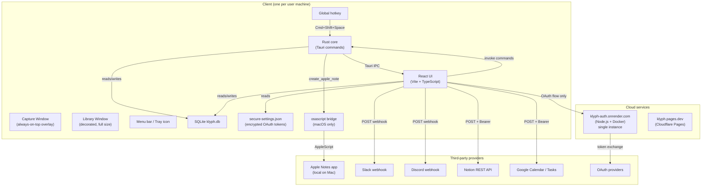
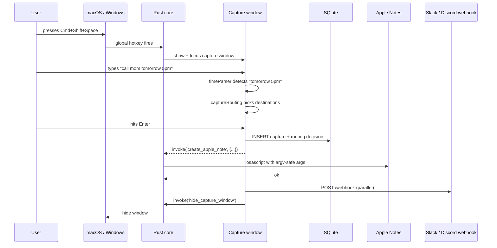
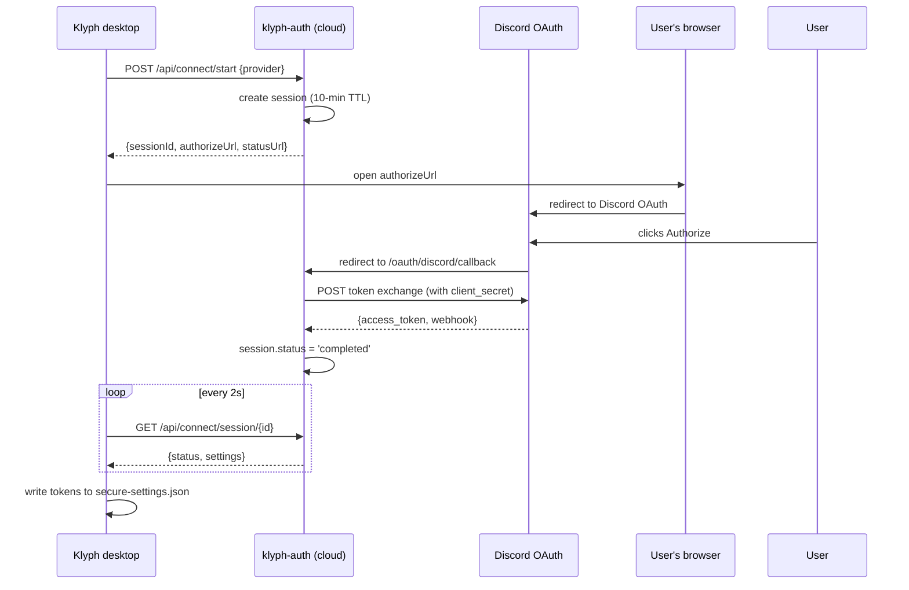
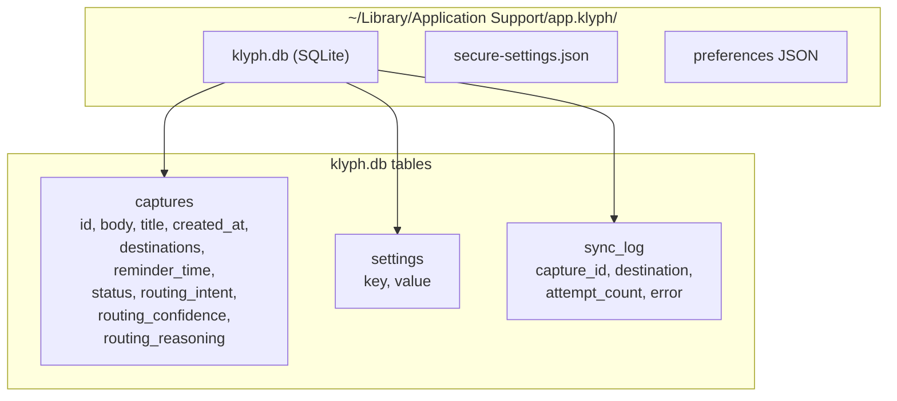

# Klyph — System Architecture

> A cross-platform desktop capture tool. Hit a hotkey from anywhere, type a thought, hit Enter — it routes to Apple Notes, Slack, Notion, Calendar, Discord, or wherever you've connected. Built for the moment between a thought and its destination.

**Status**: closed beta · macOS + Windows · v0.1.0
**Marketing site**: [klyph.pages.dev](https://klyph.pages.dev)
**Stack at a glance**: Tauri (Rust + React/TS) · SQLite · Node.js OAuth bridge on Render · Cloudflare Pages · GitHub Actions for macOS CI

---

## Table of contents

1. The problem this solves
2. Architecture in one picture
3. The technology stack, layer by layer
4. The capture flow (the hot path)
5. The OAuth flow (the rare path)
6. Storage model
7. Why these specific choices — interview-ready answers
8. Trade-offs and known limitations
9. Roadmap

---

## 1. The problem this solves

Every productivity tool wants to be the place your thoughts live. Notion wants to be your second brain. Apple Notes wants to be your sticky note. Slack wants to be your team's voice. Reminders, Calendar, Things, Bear — every app has a piece of the puzzle.

The gap: the **moment** between having a thought and deciding which app to put it in. That decision friction is where thoughts die. You open Notion to jot one line, get distracted by a notification, lose the thought.

Klyph is a single keyboard shortcut that opens a tiny capture box on top of whatever you're doing. Type the thought, hit Enter, and Klyph routes it to the right app based on what you wrote. Calendar gets the time-stamped ones, Apple Notes gets the rest, and you never had to switch context.

---

## 2. Architecture in one picture

Three planes, each with a single responsibility:

| Plane | What lives here | Why |
|---|---|---|
| **Client** | Capture window, Library window, SQLite, encrypted tokens, Rust core | Privacy: user data stays on user machine |
| **Cloud** | OAuth bridge, marketing site | Only handles things that genuinely need a server: secret-bearing OAuth and static page serving |
| **Providers** | Apple Notes (local), Slack/Discord/Notion/Google (HTTP) | Direct client-to-provider calls; cloud bridge is not a relay |

---

## 3. The technology stack, layer by layer

### Layer 1: The framework — Tauri

> **Why Tauri instead of Electron**
>
> Tauri produces a ~16 MB universal Mac installer and a ~5 MB Windows installer. The Electron equivalent would be 120–200 MB. Tauri uses the operating system's built-in webview (WKWebView on Mac, WebView2 on Windows) instead of bundling Chromium. Lower binary size, lower memory footprint (~50 MB vs Electron's 200–500 MB), faster startup.
>
> Trade-off: smaller plugin ecosystem and slightly inconsistent webview behavior across OSes. Worth it for a privacy-focused tool where install size matters.

Tauri apps have two halves that talk over an IPC bridge:

- **Frontend**: HTML/CSS/JS loaded in the OS webview. Can do anything a browser can do.
- **Backend**: a Rust binary. Can do anything native code can do — global hotkeys, shell commands, file system, tray icons.

Communication: frontend calls `invoke("command_name", args)`, backend exposes Rust functions tagged with `#[tauri::command]`. Backend can also `emit()` events that any frontend window can `listen()` for.

### Layer 2: The frontend — React + TypeScript + Vite

| Choice | Alternatives considered | Why this one |
|---|---|---|
| **React** | Vue, Svelte, Solid | Largest ecosystem, hireable skill, every library supports it |
| **TypeScript** | Plain JavaScript | Catches whole classes of bugs at compile time. Not a real debate in 2026 |
| **Vite** | Webpack, Parcel, Turbopack | ~100 ms cold starts, ~50 ms hot reloads. Tauri's official scaffolder uses it |
| **Zustand** for state | Redux, Context, Jotai | 1 KB, no boilerplate, doesn't trigger re-render storms |
| **Plain CSS** | Tailwind, styled-components | Wanted a custom design system, not utility classes |

### Layer 3: The backend — Rust + Tauri plugins

| Plugin | Purpose |
|---|---|
| `tauri-plugin-sql` | SQLite access from both frontend and Rust |
| `tauri-plugin-store` | JSON key-value store for UI preferences |
| `tauri-plugin-global-shortcut` | OS-level global hotkeys (Cmd+Shift+Space, Cmd+Shift+L) |
| `tauri-plugin-http` | HTTP requests bypassing webview CORS |
| `tauri-plugin-single-instance` | Refuse to launch a second copy (prevents hotkey fights) |

Custom Rust code lives in `src-tauri/src/commands.rs`. The most important command is `create_apple_note`, which shells out to `osascript` with user-supplied content passed as `argv` (not interpolated into the script string — eliminates injection).

### Layer 4: Local storage — SQLite + encrypted JSON

| Storage | Purpose | Why this shape |
|---|---|---|
| `klyph.db` (SQLite) | Captures, routing decisions, sync log | Structured queries, atomic transactions, scales to 100k+ records |
| `secure-settings.json` | OAuth access tokens, refresh tokens | Encrypted; separated so a stolen DB can't be replayed for impersonation |
| `tauri-plugin-store` JSON | Theme, hotkey, UI prefs | Tiny key-value data; doesn't justify a SQL table |

Storage path per OS:
- **macOS**: `~/Library/Application Support/app.klyph/`
- **Windows**: `%APPDATA%\app.klyph\`

The `app.klyph` directory name comes from the bundle identifier set in `src-tauri/tauri.conf.json`.

### Layer 5: The OAuth bridge — Node.js + Express + Docker, hosted on Render

Why a server exists at all: OAuth `client_secret`s can't ship in a client binary because anyone could extract them with `strings`. A tiny server does the secret-bearing token exchange, then hands the per-user access token to the client. After that, the client talks to providers directly.

| Choice | Why |
|---|---|
| **Node.js + Express** | Fastest to write for HTTP routing glue code |
| **Docker** | Portable across hosts (Render, Fly, Railway, a VPS) |
| **Render** | Free Docker hosting, reads `render.yaml`, auto-deploys on git push |
| **Single instance** | OAuth sessions stored in-memory `Map`; horizontal scaling would require Redis |

### Layer 6: The marketing site — Static HTML + Vite, hosted on Cloudflare Pages

Three pages, no framework. Reaching for Next.js for a marketing site is build-tool theater. Cloudflare Pages because its edge network is genuinely the fastest, and `wrangler pages deploy dist/` is one command.

### Layer 7: CI/CD — GitHub Actions for macOS, local script for Windows

The friction: I can't build a Mac `.dmg` from a Windows machine because Apple's tooling only runs on macOS. GitHub Actions provides free macOS runners (`macos-14` is Apple Silicon). The workflow at `.github/workflows/macos-build.yml`:

1. Triggers on manual button or `v*` git tags
2. Compiles for both Intel and Apple Silicon in one universal binary (`--target universal-apple-darwin`)
3. Uploads the `.dmg` as a downloadable artifact

Windows builds run locally via `npm run friend:build`.

---

## 4. The capture flow (the hot path)

Two important properties of this path:

- **Capture content never touches the cloud bridge.** Slack/Discord/Notion/Google calls go directly from client to provider. The bridge is not in the data path.
- **Apple Notes is entirely local.** Rust → osascript → Notes.app. No network, no permission required beyond macOS Automation.

---

## 5. The OAuth flow (the rare path)

Runs once per provider per user.

After this completes, the bridge gets out of the way. Klyph talks to Discord directly for every subsequent capture.

The only ongoing bridge involvement: Google access tokens expire every hour, so Klyph calls `POST /api/google/refresh-token` with the refresh token, and the bridge uses `GOOGLE_CLIENT_SECRET` to mint a new access token.

---

## 6. Storage model

Three storage artifacts per user, each with a different security profile:

| File | What's in it | Protection |
|---|---|---|
| `klyph.db` | Captures, routing decisions | Standard file permissions |
| `secure-settings.json` | OAuth tokens | Encrypted at rest |
| Preferences JSON | UI state | Plain text (nothing sensitive) |

---

## 7. Why these specific choices — interview-ready answers

### Why Tauri instead of Electron?

Smaller binary (~16 MB vs 150 MB), lower memory footprint (~50 MB vs 300 MB), uses OS-native webview instead of bundling Chromium. Trade-off: smaller plugin ecosystem and slight webview inconsistency across OSes. For a privacy-focused tool where install size matters, the trade was worth it.

### Why a separate OAuth bridge instead of putting the secret in the app?

Client secrets can't ship in client binaries — anyone can extract them with `strings`. The bridge does only the secret-bearing token exchange; the resulting per-user access token lives on the client and gets used directly with the provider from then on. The bridge sees no user data after the initial handshake.

### Why SQLite instead of a cloud database?

Two reasons. First, the privacy story is honest — captures genuinely never leave the user's machine. Second, single-user productivity tools don't benefit from a cloud DB; you'd pay for hosting and latency and offline-breakage in exchange for nothing the user actually wanted.

### How do the two windows talk to each other?

Tauri's built-in event bus. The Rust core or any frontend window can `emit` events that any other window can `listen` for, namespaced with `klyph://`. Saving a capture in the overlay emits `klyph://capture-saved`, which the Library window picks up and re-renders. Avoids polling or shared state machines.

### How did you handle Apple Notes given there's no official API?

AppleScript via `osascript`, shelled from Rust. The script is hardcoded; user-supplied content is passed as `argv` instead of being interpolated into the script string, so script injection is impossible. The Notes folder is auto-created if missing. Falls back to a clear "grant Klyph Automation permission in System Settings" error on failure.

### Why is the OAuth bridge constrained to a single instance?

Sessions are stored in an in-memory `Map<sessionId, sessionState>`. Horizontally scaling would require Redis or Postgres for session state. For the actual connect-flow volume (one connect per user per provider, maybe 10/day total), one instance is plenty. Deliberate cost-vs-complexity trade.

### Why universal macOS binary instead of separate Intel and Apple Silicon `.dmg`s?

One installer for all Macs is a better user experience and prevents the "I downloaded the wrong build" support burden. Costs ~2× CI build time, saves infinite future confusion.

---

## 8. Trade-offs and known limitations

| Trade-off | What we accepted | What it costs |
|---|---|---|
| Free Render tier for OAuth bridge | $0/mo hosting | Instance sleeps after 15 min of inactivity; 50-second cold start on wake |
| In-memory OAuth sessions | No Redis/DB dependency | Can't horizontally scale; sessions don't survive deploys |
| Unsigned beta builds | $0 Apple Developer fee | Users must right-click → Open on first launch (Gatekeeper) |
| Local-only storage | Strong privacy story | No cross-device sync; backups are user's responsibility |
| Tauri instead of Electron | Smaller, faster, native feel | Smaller plugin ecosystem; less Stack Overflow coverage |
| Direct client→provider HTTP | Reduces hosting cost and privacy exposure | Each integration is bespoke client-side code |
| Single dev building it | Faster decisions, no committee | No code review, larger blast radius for bugs |

---

## 9. Roadmap

Near-term (next month):

- Apple Notes verified in production with first beta tester
- Real Discord and Google OAuth credentials wired in (currently placeholders for the bridge)
- Windows beta to a second tester
- Optional: code-signing the macOS build so Gatekeeper stops scaring users

Medium-term (3 months):

- Add Linear and Things 3 integrations
- iCloud sync of `klyph.db` via the user's existing iCloud Drive (opt-in)
- Search-as-you-type in the Library window
- Custom routing rules ("anything containing 'idea' goes to my Notion ideas page")

Long-term (open questions):

- Replace rule-based routing with an LLM that learns the user's patterns
- Mobile companion app for read-only browsing of captures
- Paid tier for hosted sync (only if there's real demand)

---

**Built by**: Omkar
**Repo**: private on GitHub
**Contact**: hi@klyph.app

